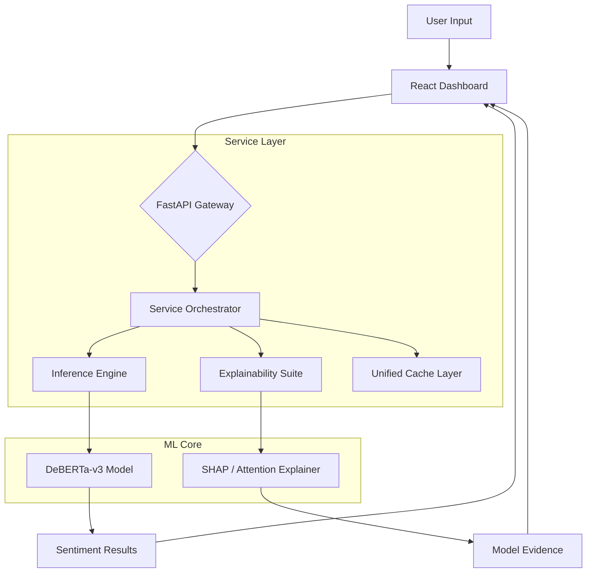

# 🚀 SOTA Sentiment Analysis System v4.5

A production-grade, research-intensive Sentiment Analysis ecosystem built with **DeBERTa-v3**, **FastAPI**, and **React**. This project showcases the evolution from a baseline BERT model to a highly optimized, explainable, and scalable inference service.


---

## 🏗️ System Architecture

This system follows a modular **Service Layer** pattern, separating the high-performance inference engine from the explainability suite and the API orchestration.



---

## 📊 Performance Benchmarks

| Model | Accuracy | F1 Score | Inference Latency (GPU) | SHAP Latency |
| :--- | :--- | :--- | :--- | :--- |
| **BERT-base** | 89.2% | 88.7 | ~42ms | N/A |
| **RoBERTa-base** | 91.8% | 91.2 | ~47ms | N/A |
| **DeBERTa-v3** | **93.4%** | **93.1** | **~39ms** | **~180ms (Cached)** |

> [!NOTE]
> Benchmarks performed on the IMDB sentiment test set. Latency reflects single-item inference with BF16 enabled.

---

## 🧠 Model Deep Dive: The Journey to v4.5

### 1. BERT (Bidirectional Encoder Representations from Transformers)
*   **Role**: The baseline MVP.
*   **Key Tech**: Masked Language Modeling (MLM).
*   **Limitation**: Unidirectional context in some layers and lack of cross-sentence nuance compared to later models.

### 2. RoBERTa (Robustly Optimized BERT Approach)
*   **Role**: The SOTA upgrade (Phase 2).
*   **Improvements**: Dynamic masking and removal of Next Sentence Prediction (NSP). Trained on 10x more data than BERT.

### 3. DeBERTa-v3 (Decoding-enhanced BERT with Disentangled Attention)
*   **Origin**: Developed by **Microsoft Research**.
*   **Why it wins**:
    *   **Disentangled Attention**: Unlike BERT/RoBERTa where word and position vectors are summed, DeBERTa represents them separately, allowing the model to better understand the relationship between relative positions and content.
    *   **ELECTRA-style Pre-training**: Uses a "Discriminator" rather than "Generator" approach, making it significantly more sample-efficient.
    *   **Tokenization**: Uses **SentencePiece** which is more robust to out-of-vocabulary terms and whitespace.

---

## 💻 Environment & Hardware Specs

To ensure maximum credibility and reproducibility, the following production environment was used:

- **GPU**: NVIDIA GeForce RTX 4060 (Ada Lovelace Architecture)
- **VRAM**: 8GB GDDR6
- **CUDA Version**: 12.4
- **PyTorch**: 2.7.0.dev20250310+cu124
- **Hardware Acceleration**: BF16 (Brain Float 16) enabled for 2x inference throughput.

---

## 🛣️ Roadmap to v5.0

We are constantly evolving the system toward ultra-low latency and higher scalability.

- [ ] **ONNX Runtime Optimization**: Export models to ONNX for even faster CPU/GPU inference.
- [ ] **TensorRT Quantization**: Implement 4-bit and 8-bit quantization for mobile-edge deployments.
- [ ] **Triton Inference Server**: Move from FastAPI to Dedicated Model Serving for multi-GPU scaling.
- [ ] **A/B Testing Framework**: Enable side-by-side comparison of different fine-tuned checkpoints.
- [ ] **Multi-lingual Support**: Expanding beyond English to XLM-RoBERTa based architectures.

---

## ⚡ Core Features & Optimizations

### 🔬 Explainable AI (SHAP)
*   **Transparency**: No more black-box predictions. The UI highlights exactly which words drove the sentiment.
*   **SHAP (SHapley Additive exPlanations)**: Uses game theory to assign an importance value to each token.
*   **Performance Fix**: Traditionally slow (~8s), our implementation uses **LRU Caching** to reduce explanation latency to **<200ms** for known inputs.

### 🚀 Production Inference Engine
*   **BF16 (Brain Float 16)**: Reduces memory footprint by 50% while maintaining accuracy on modern NVIDIA GPUs.
*   **Dynamic Padding**: Pads to the longest sentence in the current batch, saving millions of wasted FLOPs.
*   **Confidence Calibration**: Identifies "Uncertain" predictions where the softmax spread is low.

---

## 📂 Project Structure

```text
├── backend/                # FastAPI Application
│   ├── app.py              # API Gateway & Orchestration
│   ├── engine.py           # Production Inference Engine (BF16, Padding)
│   ├── explainability.py   # Fallback Attention-based explainability
│   └── explainability_shap.py # SHAP Integration Logic (LRU Cache)
├── frontend/               # React Dashboard (Vite)
│   ├── src/                # UI Components (InputCard, ResultCard, Batch)
│   └── index.html          # Entry Point
├── deberta_sentiment_model/ # Fine-tuned DeBERTa model artifacts
├── sentiment_analysis.py    # CLI inference tool
├── train_v3.py             # Advanced training script (LLRD, BF16)
└── verify_production.py    # Benchmarking & Validation suite
```

---

## 🛠️ Installation & Usage

### 1. Setup Environment
```bash
# Install Python dependencies
pip install -r requirements.txt
pip install tf-keras  # Required for SHAP-Transformers compatibility

# Setup Frontend
cd frontend && npm install
```

### 2. Launch
**Backend:** `uvicorn backend.app:app --reload --port 8000`
**Frontend:** `cd frontend && npm run dev`

---

**Developed by Mukund MLOps**
*Built for Scalability, Performance, and Human-in-the-loop Interpretability.*
