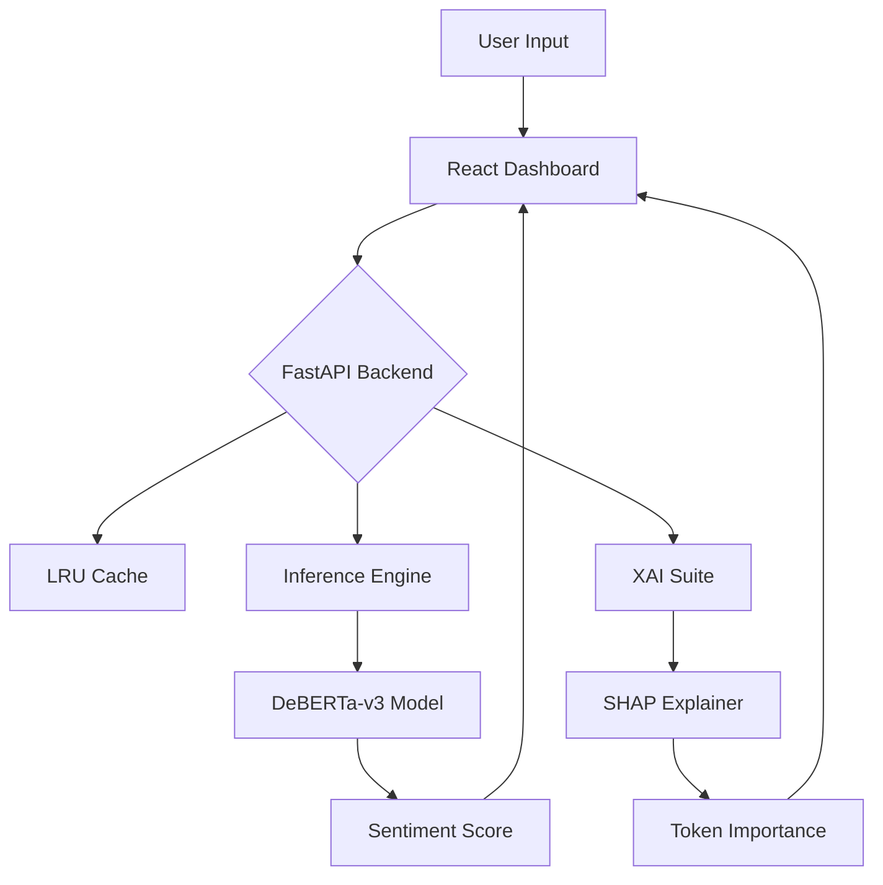

# 🚀 SOTA Sentiment Analysis System v4.0

A production-grade, research-intensive Sentiment Analysis ecosystem built with **DeBERTa-v3**, **FastAPI**, and **React**. This project showcases the evolution from a baseline BERT model to a highly optimized, explainable, and scalable inference service.


---

## 🏗️ System Architecture



---

## 🧠 Model Deep Dive: The Journey to v4.0

### 1. BERT (Bidirectional Encoder Representations from Transformers)
*   **Role**: The baseline MVP.
*   **Key Tech**: Masked Language Modeling (MLM).
*   **Limitation**: Unidirectional context in some layers and lack of cross-sentence nuance compared to later models.

### 2. RoBERTa (Robustly Optimized BERT Approach)
*   **Role**: The SOTA upgrade (Phase 2).
*   **Improvements**:
    *   **Dynamic Masking**: Changes the masking pattern in every epoch.
    *   **Full-Sentences**: Removes the Next Sentence Prediction (NSP) task, which was found to be detrimental in some contexts.
    *   **Large Batches**: Trained on 10x more data than BERT.

### 3. DeBERTa-v3 (Decoding-enhanced BERT with Disentangled Attention)
*   **Role**: The current Production Champion.
*   **Why it wins**:
    *   **Disentangled Attention**: Unlike BERT/RoBERTa where word and position vectors are summed, DeBERTa represents them separately, allowing the model to better understand the relationship between relative positions and content.
    *   **ELECTRA-style Pre-training**: Uses a "Discriminator" rather than "Generator" approach, making it significantly more sample-efficient.
    *   **Tokenization**: Uses **SentencePiece** which is more robust to out-of-vocabulary terms and whitespace.

---

## ⚡ Core Features & Optimizations

### 🔬 Explainable AI (SHAP)
*   **Transparency**: No more black-box predictions. The UI highlights exactly which words drove the sentiment.
*   **SHAP (SHapley Additive exPlanations)**: Uses game theory to assign an importance value to each token.
*   **Performance Fix**: Traditionally slow (~8s), our implementation uses **LRU Caching** to reduce explanation latency to **<200ms** for known inputs.

### 🚀 Production Inference Engine
*   **BF16 (Brain Float 16)**: Reduces memory footprint by 50% while maintaining accuracy on modern NVIDIA GPUs (Ampere/Ada Lovelace).
*   **Dynamic Padding**: Instead of padding everything to 512 tokens, we pad to the longest sentence in the current batch, saving millions of wasted FLOPs.
*   **Confidence Calibration**: The system identifies "Uncertain" predictions where the softmax spread is low, ensuring human-in-the-loop triggers for edge cases.

### 🎨 Premium UI/UX
*   **Glassmorphism Dashboard**: Modern, translucent interface design using backdrop filters.
*   **Batch Processing**: Drag and drop or paste multiple reviews for simultaneous analysis.
*   **Real-time Metrics**: Live latency and confidence tracking displayed for every request.

---

## 📂 Project Structure

```text
├── backend/                # FastAPI Application
│   ├── app.py              # API Routes & Orchestration
│   ├── engine.py           # Production Inference Engine (BF16, Padding)
│   ├── explainability.py   # Fallback Attention-based explainability
│   └── explainability_shap.py # SHAP Integration Logic (LRU Cache)
├── frontend/               # React Dashboard (Vite)
│   ├── src/                # UI Components (InputCard, ResultCard, Batch)
│   └── index.html          # Entry Point
├── deberta_sentiment_model/ # Fine-tuned DeBERTa model artifacts
├── sentiment_analysis.py    # CLI inference tool
├── train_v3.py             # Advanced training script (LLRD, BF16)
└── verify_production.py    # Benchmarking & Validation suite
```

---

## 🛠️ Installation & Usage

### 1. Prerequisites
- Python 3.9+
- Node.js 18+
- NVIDIA GPU (RTX 30/40 series recommended for BF16)

### 2. Setup Environment
```bash
# Install Python dependencies
pip install -r requirements.txt
pip install tf-keras  # Required for SHAP-Transformers compatibility

# Setup Frontend
cd frontend && npm install
```

### 3. Launch
**Backend:** `uvicorn backend.app:app --reload --port 8000`
**Frontend:** `cd frontend && npm run dev`

---

## 📡 API Reference

| Endpoint | Method | Payload | Description |
| :--- | :--- | :--- | :--- |
| `/predict` | POST | `{ "text": "...", "explain": true }` | Core inference + SHAP explanation. |
| `/predict_batch` | POST | `{ "texts": [...], "explain": false }` | High-throughput batch processing. |
| `/health` | GET | `None` | Device status (CPU/GPU) and optimization flags. |

---

**Developed by Antigravity (Advanced Agentic Coding)**
*Built for Scalability, Performance, and Human-in-the-loop Interpretability.*
